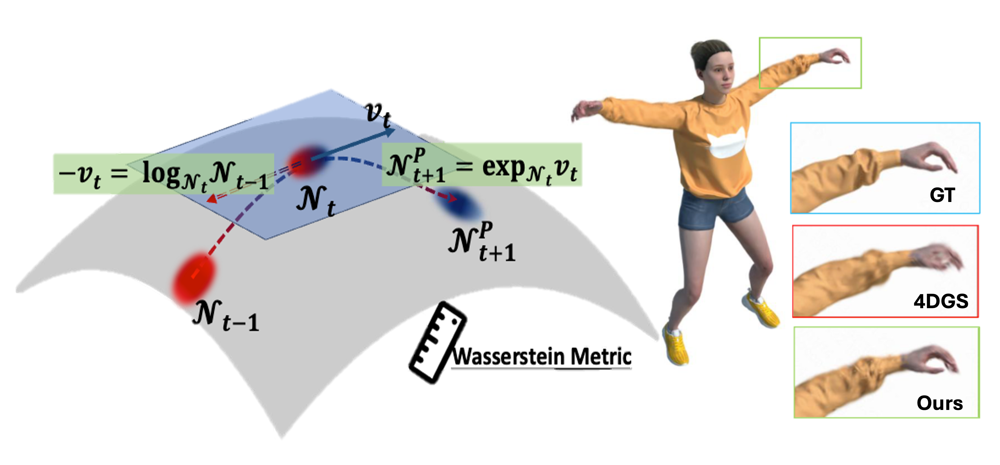

## WGS: Wasserstein Gaussian Splatting for Dynamic Scene Rendering
Official repository for the paper [Gaussians on their Way: Wasserstein-Constrained 4D Gaussian Splatting with State-Space Modeling](docs/arxiv_WGS.pdf) by Junli Deng$^{\dagger}$ and Yihao Luo$^{\dagger*}$. This repository implements a novel approach that combines state-space modeling with Wasserstein geometry to achieve more natural and fluid motion in 4D Gaussian Splatting for dynamic scene rendering. 

Our method addresses the fundamental challenge of making 3D Gaussians move through time as naturally as they would in the real world while maintaining smooth and consistent motion.

### Overview



Dynamic scene rendering has seen significant advances with 4D Gaussian Splatting, but accurately modeling scene dynamics remains challenging due to limitations in estimating precise Gaussian transformations. Our approach draws inspiration from control theory and introduces three key innovations:

- **State Consistency Filter**: By modeling each Gaussian's deformation as a state in a dynamic system, we merge prior predictions with current observations to estimate transformations more accurately, enabling Gaussians to maintain temporal consistency.

- **Wasserstein Distance Regularization**: We employ Wasserstein distance as a key metric between Gaussian distributions to ensure smooth and consistent parameter updates, effectively reducing motion artifacts while preserving the underlying Gaussian structure.

- **Wasserstein Geometry Modeling**: Our framework leverages Wasserstein geometry to capture both translational motion and shape deformations in a unified way, resulting in more physically plausible Gaussian dynamics and improved motion trajectories.

Our method guides Gaussians along their natural way in the Wasserstein space, achieving smoother, more realistic motion and stronger temporal coherence. Experimental results demonstrate significant improvements in both rendering quality and efficiency compared to current state-of-the-art techniques.

### TODO List

#### 🚧 In Progress
- [x] Core differentiable Wasserstein geometry implementation in `WassersteinGeom_Yihao.py`
  - Wasserstein distance calculation
  - Wasserstein logarithmic mapping
  - Wasserstein exponential mapping
  - Gaussian distribution merging
- [x] Release inference code
- [x] Upload pre-trained models
- [x] Add video demonstrations
- [ ] Create documentation for model usage
- [ ] Add evaluation scripts
- [ ] Provide example training configurations
- [ ] Create installation guide
- [ ] Add benchmarking results
- [ ] Provide data preprocessing scripts

#### 📝 Future Plans
- [ ] Wasserstein flow optimization
- [ ] Support for more dynamic scene types
- [ ] Real-time rendering optimization
- [ ] Multi-GPU training support
- [ ] Interactive visualization tools
- [ ] Integration with popular rendering frameworks


### How to Use

#### Wasserstein Geometry on Gaussians
One of the key innovations in our approach is the integration of Wasserstein geometry into the Gaussian dynamics modeling. We provide a set of differentiable PyTorch classes that implement explicit computing of Wasserstein distance, logarithmic and exponential mappings, and Gaussian distribution merging. These classes are essential for modeling the dynamics of Gaussian distributions in a consistent and physically plausible manner. 

Only pure [PyTorch](https://pytorch.org/) is required to run the code.

For quick start, run the following command 
```bash
cd WassersteinGS
python WassersteinGeom_Yihao.py
```

Sample code snippets for using these classes are provided below:

1. Prepare the data for two batches of Gaussian distributions:

```python
import torch
from WassersteinGeom_Yihao import WassersteinDistGS, WassersteinLog, WassersteinExp

device = torch.device("cuda")
B = 6 # batch size
# Example data
loc0 = torch.randn(B, 3).to(device)
cov0 = torch.randn(B, 3, 3).to(device)
cov0 = cov0.bmm(cov0.transpose(1, 2))+1e-8*torch.eye(3).to(device).unsqueeze(0) 
# make it positive definite
loc1 = torch.randn(B, 3).to(device)
cov1 = torch.randn(B, 3, 3).to(device)
cov1 = cov1.bmm(cov1.transpose(1, 2))+1e-8*torch.eye(3).to(device).unsqueeze(0) 
# Eigenvalue decomposition (Optional)
scale0, rot0 = torch.linalg.eigh(cov0) # R@diag(S)@R^T = cov
scale1, rot1 = torch.linalg.eigh(cov1)
```

2. Compute the Wasserstein distance between two Gaussian distributions:

```python
# Wasserstein distance
WG_dist = WassersteinDistGS()
dist = WassersteinDistGS()(loc0, scale0, rot0, loc1, scale1, rot1)
# Alternatively, you can provide covariance matrices directly
# dist = WG_dist(loc0=loc0, scale0=None, rot_matrix0=None, loc1=loc1, scale1=None, 
#                rot_matrix1=None, cov0=cov0, cov1=cov1) 
print("Wasserstein distance from GS0 to GS1:", dist)
```
3. Compute the logarithmic mapping between two Gaussians (velocity and velocity covariance):

```python
# Wasserstein logarithmic mapping
miu_velocity, cov_velocity = WassersteinLogGS()(loc_1, loc_0, cov_1, cov_0)
miu_velocity = -miu_velocity
cov_velocity = -cov_velocity
```
*Remark. Note that the velocity from 'GS0' to 'GS1' is not generally the inverse of the velocity from 'GS1' to 'GS0' in Wasserstein space. The velocity is computed in the tangent space of the Wasserstein manifold.*

4. Compute the exponential mapping to predict the new Gaussian distribution based on the previous frame's distribution and the current frame's velocity and velocity covariance:

```python
# Wasserstein exponential mapping
new_loc, new_cov = WassersteinExpGS()(loc_0, cov_0, miu_velocity, cov_velocity)
## Check the distance between the GS0 and the new GS
dist = WG_dist(loc0, scale0, rot0, new_loc, scale1=None, rot1=None, cov1=new_cov)
print("Wasserstein distance from GS0 to GS2:", dist)
```

The results may look like this:
```
Wasserstein distance from GS0 to GS1:  
tensor([1.8248, 3.8078, 2.0212, 2.9639, 3.5641, 2.4605], device='cuda:0')
Wasserstein distance from GS0 to GS2:  
tensor([3.6496, 7.4741, 4.0424, 4.4655, 7.1282, 4.6840], device='cuda:0')
```
It is easy to see that the Wasserstein distance between GS0 and GS2 is approximately twice the distance between GS0 and GS1. In other words, GS2 is a natural extension of GS1 from GS0.

#### 4D Gaussian Splatting for Dynamic Scene Rendering


### Citation
If you find this repository helpful in your research or project, please consider citing our work:

```
@article{WGS2021,
  title={Gaussians on their Way: Wasserstein-Constrained 4D Gaussian Splatting with
        State-Space Modeling},
  author={Deng, Junli and Luo, Yihao},
}
@article{luo2021geometric,
  title={Geometric Characteristics of the Wasserstein Metric on SPD(n) 
  and Its Applications on Data Processing},
  author={Luo, Yihao and Zhang, Shiqiang and Cao, Yueqi and Sun, Huafei},
  journal={Entropy},
  volume={23},
  number={9},
  pages={1214},
  year={2021},
  publisher={MDPI}
}
```
We appreciate any feedback, suggestions, or potential collaborations. Please feel free to reach out to us at [y.luo23@imperial.ac.uk](mailto:y.luo23@imperial.ac.uk).

### License
This project is licensed under the MIT License - see the [LICENSE](LICENSE) file for details.

